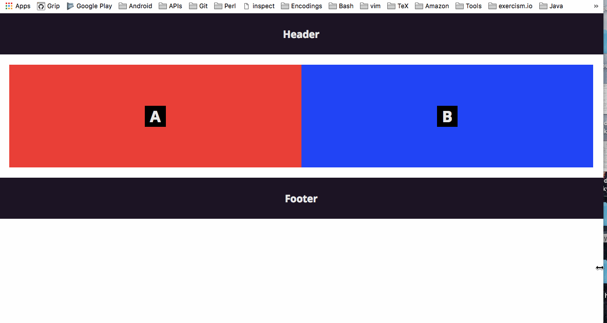

# Media Query Orientation

[Check it out](https://weibeld.github.io/webdesign-media-query-orientation/)

A simple example showing how to adapt the layout of a page to the screen orientation (portrait vs. landscape) by using a **media query**.

This makes sense for when a website is accessed with a mobile phone.

## Summary

To include or exclude CSS rules based on the screen orientation, we can use the following media query:

~~~css
@media only screen and (orientation: landscape) {
  /* CSS rules */
}
~~~

We use *portrait* as the default orientation and include special rules on *landscape*.

Portrait is defined as the height greater than or equal to the width of the screen, and landscape is defined as the width greather than the height of the screen.
